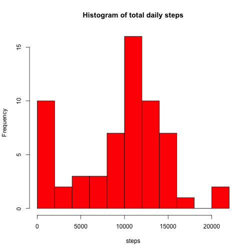
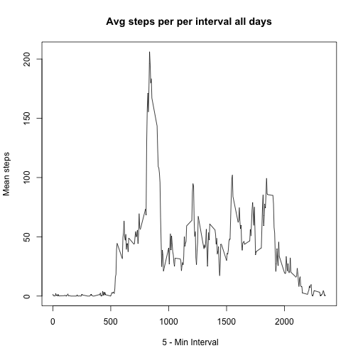
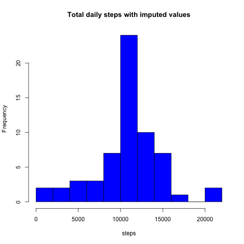
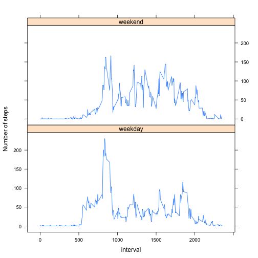

# PA1 - Course Project 1 

### This project reports on  data from a personal activity monitooring device 

We start by loading in some required packages

```r
suppressPackageStartupMessages(library(dplyr))
library(dplyr)
library(lattice)
```

Next we load the source data file and convert the date column to a proper date format.


```r
unzip("activity.zip")
mydata<-tbl_df(read.csv("activity.csv",sep=",",header=TRUE,colClasses=c("numeric","character","numeric")))
mydata$date=as.Date(mydata$date)
```
Here is a partial listing of the first few observations:

```r
mydata
```

```
## Source: local data frame [17,568 x 3]
## 
##    steps       date interval
##    (dbl)     (date)    (dbl)
## 1     NA 2012-10-01        0
## 2     NA 2012-10-01        5
## 3     NA 2012-10-01       10
## 4     NA 2012-10-01       15
## 5     NA 2012-10-01       20
## 6     NA 2012-10-01       25
## 7     NA 2012-10-01       30
## 8     NA 2012-10-01       35
## 9     NA 2012-10-01       40
## 10    NA 2012-10-01       45
## ..   ...        ...      ...
```


### Problem 1 : What is the mean total number of steps taken per day?

step1: Calculate the total number of steps per day


```r
total_stepsperday<-summarize(mydata %>% group_by(date),sum(steps,na.rm=T) )
names(total_stepsperday)=c("date","steps")
```

Here are the first few records of the total of steps per day:

```r
total_stepsperday
```

```
## Source: local data frame [61 x 2]
## 
##          date steps
##        (date) (dbl)
## 1  2012-10-01     0
## 2  2012-10-02   126
## 3  2012-10-03 11352
## 4  2012-10-04 12116
## 5  2012-10-05 13294
## 6  2012-10-06 15420
## 7  2012-10-07 11015
## 8  2012-10-08     0
## 9  2012-10-09 12811
## 10 2012-10-10  9900
## ..        ...   ...
```

step2: Histogram of the total number of steps taken each day


```r
with(total_stepsperday,hist(steps,col="red",breaks=10,main="Histogram of total daily steps"))
```



step 3: Calculate mean and median of the total number of steps


```r
meansteps<-mean(total_stepsperday$steps)
mediansteps<-median(total_stepsperday$steps)
```

The mean of the total steps per day is: 9354.

The median of the total steps per day is: 10395.

## Problem 2: What is the average daily activity pattern?

step 1: Time series plot of the 5-minute interval and the average number of steps taken, averaged across all days(y-axis)


```r
avg_steps_perday_perinterval<-summarize(mydata %>% group_by(interval),mean(steps,na.rm=T) )
plot(avg_steps_perday_perinterval,type='l',xlab=' 5 - Min Interval',ylab='Mean steps',main='Avg steps per per interval all days')
```



```r
names(avg_steps_perday_perinterval)=c("interval","mean_steps")
```

step 2:

Which 5 minute interval contain on average the maximum number of steps?


```r
 topsteps<-top_n(avg_steps_perday_perinterval,1,mean_steps)
```


The interval classified as 835 with 206 has the on average the maximum number of steps

 
 
## Problem 3 : Inputing missing values

Step 1: Calculate the total number of missing values

```r
missing<-filter(mydata,is.na(steps)==T)
missing_total<-dim(missing)[1]
```


There are a total number of 2304 of observations with missing steps.


Step 2: Fill in the missing values

The strategy we will follow to fill in the missing values is to use the mean for that interval. For this purpose we define an auxiliary function that imputes the mean of a vector(not considering missing values) to any missing values in that vector.


```r
impute.mean <- function(x) replace(x, is.na(x), mean(x, na.rm = TRUE))
avg_steps_perday_perinterval_imputed<-summarize(mydata %>% group_by(interval) %>% mutate(steps=impute.mean(steps)), mean(steps))
```

Step 3: 

We have created a new dataset which is the same as the original data set but with the missing values filled.

```r
mynewdata<-ungroup(mydata %>% group_by(interval) %>% mutate(steps=impute.mean(steps)))
mynewdata$steps=round(mynewdata$steps,2)
mynewdata
```

```
## Source: local data frame [17,568 x 3]
## 
##    steps       date interval
##    (dbl)     (date)    (dbl)
## 1   1.72 2012-10-01        0
## 2   0.34 2012-10-01        5
## 3   0.13 2012-10-01       10
## 4   0.15 2012-10-01       15
## 5   0.08 2012-10-01       20
## 6   2.09 2012-10-01       25
## 7   0.53 2012-10-01       30
## 8   0.87 2012-10-01       35
## 9   0.00 2012-10-01       40
## 10  1.47 2012-10-01       45
## ..   ...        ...      ...
```


Step 4: Histogram of total number of steps taken each day for the new data set.


```r
total_stepsperday_imputed<-summarize(mynewdata %>% group_by(date),sum(steps,na.rm=T) )
names(total_stepsperday_imputed)=c("date","steps")
with(total_stepsperday_imputed,hist(steps,col="blue",breaks=10,main="Total daily steps with imputed values"))
```




```r
meanstepsimputed<-mean(total_stepsperday_imputed$steps)
medianstepsimputed<-median(total_stepsperday_imputed$steps)
```

The mean of the total number of steps with imputed values is: 10766
The median of the total number of steps with imputed values is: 10766

These values are slightly higher compared to the previous calculations. This is due to the replacement of the NA values with mean per interval values. So the frequency count of the histograms goes up due to those cases.


## Problem 4 : Are there differences in activity patterns between weekdays and weekends?

Step 1: Create a new factor variable with two levels - weekday and weekend

Here are the first few lines of the dataset wth the aggregated column


```r
mynewdatawithweekdays<-mutate(mynewdata,dayclass=weekdays(date))
weekends<-c("Saturday","Sunday")
mynewdatawithweekdays$dayclass<-factor((mynewdatawithweekdays$dayclass %in% weekends),levels=c(F,T),labels=c("weekday","weekend"))
mynewdatawithweekdays
```

```
## Source: local data frame [17,568 x 4]
## 
##    steps       date interval dayclass
##    (dbl)     (date)    (dbl)   (fctr)
## 1   1.72 2012-10-01        0  weekday
## 2   0.34 2012-10-01        5  weekday
## 3   0.13 2012-10-01       10  weekday
## 4   0.15 2012-10-01       15  weekday
## 5   0.08 2012-10-01       20  weekday
## 6   2.09 2012-10-01       25  weekday
## 7   0.53 2012-10-01       30  weekday
## 8   0.87 2012-10-01       35  weekday
## 9   0.00 2012-10-01       40  weekday
## 10  1.47 2012-10-01       45  weekday
## ..   ...        ...      ...      ...
```

Step 2: Panel plot of average steps by all weekdays and weekends


```r
final<-summarize(mynewdatawithweekdays %>% group_by(dayclass,interval),mean(steps))
names(final)=c("dayclass","interval","steps")
xyplot(final$steps~final$interval|final$dayclass, layout=c(1,2),type='l',xlab='interval',ylab='Number of steps')
```


